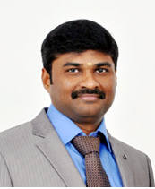

K. Vishnu Kumar(비쉬누쿠마) Ph.D

*	Email: vishnudms@gmail.com

### Biography 
Dr. Vishnu Kumar Kaliappan is working as Research Professor at DMS Laboratory, Computer Science and Engineering, College of Engineering, Konkuk University, Seoul, South Korea. 
He received his Ph.D in Computer and Information Communication Engineering from Konkuk University, Seoul, South Korea during 2012 and 
received M.Tech in Communication Engineering from VIT University, Vellore, India. 
He is an Editorial Manager at ISIUS (International Society of intelligent Unmanned System), Korea. 
He worked the project under KARI (Korean Aerospace Research Institute), Degu, South Korea and at CABS (Center For Air Born System), DRDO, Bangalore, India. 
He received one of the Korean prestigious Scholarship IITA (International Information Technology Admission) 
from Ministry of Information Technology, Seoul, South Korea in the 2007-2012. 
His name has been indexed in world’s popular and leading biographical data base “Marquis Who’s Who in the World” in the year of 2014-2020.  
His teaching is primarily focused in the area of Artificial Intelligence, Cyber Physical Systems and Wireless Sensor Networks. 
The focus of his research is on development of bio mimetic algorithms, AI based multi control systems, 
Cyber Physical System, Hardware in the Loop Simulation (HILS) and High-Level Control algorithms for unmanned aerial vehicles. 
He has been acted as reviewer and editorial member for more 50 international conference and journals.  

### Research Experience
*	Development of Intelligent algorithms for Unmanned Aerial Vehicle,
*	Intelligent Transportation System
*	Deep learning model development for precision farming
*	Metaverse concepts for Real and virtual space integration
*	CPS Integration Middleware
*	Real-time Disaster-Prevention System using Unmanned Aerial Vehicle
*	KIPA TOY (Kids Edutainment: Learning Through Play)
*	Development of Hardware In the Loops Simulation (HILS) for UAM (Urban Air Mobility)

### Research Area
*	Cyber Physical Systems
*	Deep Learning models for Vision based systems 
*	Deep Learning models for UAV high level Control system 
*	Internet of Things

