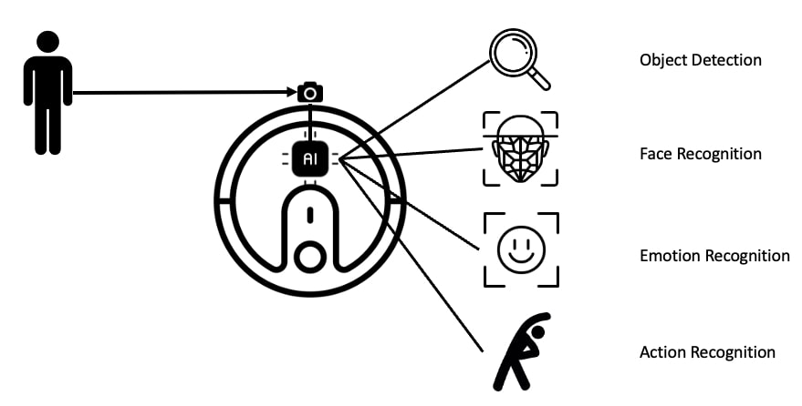

# Research on Deep Learning-based Computer Vision (김형규)
## Computer Vision is one of the latest areas of computer science that studies the part of a machine's vision
## The DMS Vision team is working on an interactive healthcare cleaning robot system for the Silver Generation.
- Object detection to detect people,
- Face recognition to recognize a particular user,
- Emotion Recognition for monitoring user emotions,
- Action Recognition to recognize the user's motion,
- Pose Estimation to perform the user's exercise assistance role.

 
## Face and Emotion Recognition (장이나)
그림 1

### Thesis Title:Multi-task Emotion Recognition Based on Context-aware and Attention Module(장이나)
- Summary:Emotion recognition is an important research topic in the field of computer vision, and is the primary problem in affective computing, as well as the focus and difficulty of research. It would have a better impact on our lives if we could use inexpensive machines to monitor and understand the emotional information of others. However, there is currently no system that can do such a job. Because human emotional states are expressed in various ways, such as speech, expressions, actions, the environment in which a person is living, and various physiological signals, it is difficult to accurately reflect human emotions by relying on a single characteristic parameter and its features. We propose a framework, Muti-task Emotion Recognition (MTER), with four main models: face feature extraction model, body feature extraction model and context (scene) feature extraction model, and then fusion classification model. It is used to analyze images containing multiple people and recognize fused emotions based on face facial features, body features, and contextual information. The face feature and body feature extraction module takes the face and body parts of the image as input and the information implicit in the image such as facial expression, head position and body pose is extracted. In order to make the emotion recognition actively applied to real life, Fine-tuned Mobilenet lightweight network is utilized to reduce the computational effort and increase the recognition speed.

### Survey (박상윤)
- Related Work Suvey
	- Emotion Recognition(SOTA)
		- Multitask Emotion Recognition with Incomplete Labels
  		- Deep-Emotion: Facial Expression Recognition Using Attentional Convolutional Network
	- Spatial Transformer Networks

## Pose and Activity Recognition(루카이)
그림 2
	
### Thesis Title (루카이) 
- Summary 

### Survey (조문충) 
- Related Work Suvey
   - Activity Recognition(SOTA)
   	- Multi-Label Activity Recognition using Activity-specific Features and Activity Correlations
   	- Masked Autoencoders Are Scalable Vision Learners
   - Vision Transformer

#### Research Results
- [Master Thesis] 장이나 석사논문 Multi-task Emotion Recognition Based on Context-aware and Attention Module,2022.06
- [Master Thesis] 루카이 석사논문

