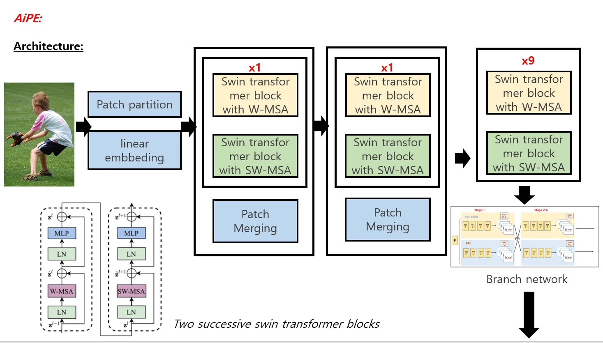

# Research on Deep Learning-based Computer Vision
- Computer Vision is one of the latest areas of computer science that studies the part of a machine's vision
- The DMS Vision team is working on an interactive healthcare cleaning robot system for the Silver Generation.
	- Object detection to detect people
	- Face recognition to recognize a particular user
	- Emotion Recognition for monitoring user emotions
	- Action Recognition to recognize the user's motion
	- Pose Estimation to perform the user's exercise assistance role

 
# Face and Emotion Recognition

### Multi-task Emotion Recognition Based on Context-aware and Attention Module
- Emotion recognition is an important research topic in the field of computer vision, and is the primary problem in affective computing, as well as the focus and difficulty of research. It would have a better impact on our lives if we could use inexpensive machines to monitor and understand the emotional information of others. However, there is currently no system that can do such a job. Because human emotional states are expressed in various ways, such as speech, expressions, actions, the environment in which a person is living, and various physiological signals, it is difficult to accurately reflect human emotions by relying on a single characteristic parameter and its features. We propose a framework, Muti-task Emotion Recognition (MTER), with four main models: face feature extraction model, body feature extraction model and context (scene) feature extraction model, and then fusion classification model. It is used to analyze images containing multiple people and recognize fused emotions based on face facial features, body features, and contextual information. The face feature and body feature extraction module takes the face and body parts of the image as input and the information implicit in the image such as facial expression, head position and body pose is extracted. In order to make the emotion recognition actively applied to real life, Fine-tuned Mobilenet lightweight network is utilized to reduce the computational effort and increase the recognition speed.

- 

# Pose and Activity Recognition

### Attention in Pose Estimation A transformer based pose estimation method
- We propose a bottom-up human pose estimation method that combines the latest achievements in computer vision-transformer. Compared with the original version using VGG, our method uses a multi-headed self-attention mechanism to better localize the key points of the human body and connect the limbs. Even for some blurred, low-resolution images we can still perform human pose estimation, and our method achieves very good results in single and few people situations. However, in dense crowd conditions, our method does not perform human pose estimation as well as VGG, which stems from the weakness of transformer in analyzing small targets. It may also be due to the fact that we did not use the four block stack like the original swin transformer in order to reduce the computational effort and control the downsampling.

	
# Current Studies
- Face Recognition
	- [Large-Margin Softmax Loss for Convolutional Neural Networks](https://arxiv.org/pdf/1612.02295)
	- [SphereFace: Deep Hypersphere Embedding for Face Recognition](https://arxiv.org/pdf/1704.08063)
	- [Additive Margin Softmax for Face Verification](https://arxiv.org/pdf/1801.05599)
	- [ArcFace: Additive Angular Margin Loss for Deep Face Recognition](https://arxiv.org/pdf/1801.07698)
- Emotion Recognition
	- [Multitask Emotion Recognition with Incomplete Labels](https://arxiv.org/pdf/2002.03557)
	- [Deep-Emotion: Facial Expression Recognition Using Attentional Convolutional Network](https://arxiv.org/pdf/1902.01019)
- Activity Recognition
	- [Multi-Label Activity Recognition using Activity-specific Features and Activity Correlations](https://arxiv.org/pdf/2009.07420)
	- [Masked Autoencoders Are Scalable Vision Learners](https://arxiv.org/pdf/2111.06377)
- [Spatial Transformer Networks](https://arxiv.org/pdf/1506.02025)
- [Vision Transformer](https://arxiv.org/pdf/2010.11929)

## Research Results
- [Master Thesis] Multi-task Emotion Recognition Based on Context-aware and Attention Module,2022.06
- [Master Thesis] AiPE: Attention in Pose Estimation A transformer based pose estimation method, 2022.06

